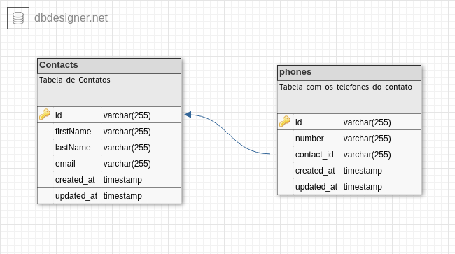

## Desafio CSP Consultoria

### API de contatos

Permite cadastrar em um banco de dados contatos com as seguintes informações:

- Id
- Primeiro Nome
- Último nome
- Email
- Telefones (realcionamento 1:n)

Para isso o banco de dados foi estruturado da seguinte forma:

<h3 align="left">
  
<h3>

### Tecnologias Utilizadas:

- typescript
- typeorm
- express
- mysql

### Rodando a aplicação

1. Faça clone do repositório e entre no novo diretório criado

```
git clone git@github.com:abelsouzacosta/csptecnologia-desafio-backend.git

cd csptecnologia-desafio-backend/

```

2. Neste projeto foi usado o typeorm, para que seja possível fazer o uso de migrations é preciso ter o pacote `ts-node` instalado globalmente, se você não possuir este pacote instalado de forma global pode instalá-lo usando o comando:

`npm -g install ts-node` ou `sudo npm -g install ts-node` (caso em ambiente linux)

3. Renomeie os arquivos `.env.local` e `.ormconfig.env` para `.env` e `ormconfig.env`, respectivamente;

4. Dentro de `.env` determine a porta da aplicação (ex: _3030_)

5. Crie um banco de dados MYSQL com um nome qualquer de sua preferência (ex: _CONTACTS_)

6. No arquivo `ormconfig.env` determine os valores das variáveis `TYPEORM_USERNAME`, `TYPEORM_PASSWORD` e `TYPEORM_DATABASE` com o usuário do banco de dados, a senha e o nome do banco de dados criado no passo anterior.

7. Rode as migrations com o comando: `yarn migration:run`

8. Inicialize a aplicação: `yarn dev`

#### Rotas

<b>[GET]</b>/contacts: Retorna todas as instâncias inseridas no banco de dados, se passada uma query parameter também é possível filtrar pelos nomes e pelo email, da seguinte forma:

`contacts?firstName=value` ou `contacts?lastName=value` ou `contacts?email=value`

<b>[POST]</b>/contacts: A rota deve receber no corpo da requisição o primeiro nome, último nome, email e um array contendo oos números de telefone do contato, como podemos ver abaixo:

```
{
	"firstName": "Name",
	"lastName": "Surname",
	"email": "email@mail.com",
	"phone_numbers": [
		"77777777777",
		"77777777778"
	]
}

```

<b>[PUT]</b>/contacts/:id: A atualiza as informações principais do contato: firstName, lastName e email. O `id` do contato deve ser passado por parametro da url, as demais informações devem ser passadas no corpo da requisição.

<b>[DELETE]</b>/contacts/:id: Remove a instância de contato com o id passado
